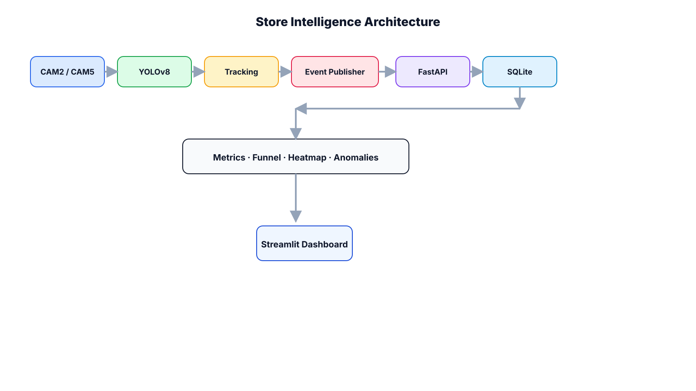

# Store Intelligence API

Store Intelligence API is a FastAPI-based retail analytics backend for a hiring challenge. It ingests store events, tracks visitor sessions, calculates conversion metrics, and exposes analytics for funnels, heatmaps, and anomalies. The implementation is intentionally backend-first and optimized for clarity, testability, and fast iteration.

## 1. Project Overview

This project models the core analytics layer of a store intelligence platform. It accepts retail event streams, maintains visitor sessions, and derives operational metrics that are useful for store performance analysis. The current implementation uses SQLite for local development and challenge submission simplicity, while keeping the codebase structured so a later database swap remains straightforward.

## 2. Architecture Overview

The codebase follows a layered FastAPI architecture:

- API layer: request/response handling and dependency injection
- Service layer: business rules and analytics calculations
- Model layer: SQLAlchemy ORM tables
- Schema layer: Pydantic request and response validation
- Core layer: configuration, logging, and middleware
- DB layer: engine, session factory, and initialization scripts

This separation keeps route handlers thin and makes the core analytics logic easy to test in isolation.

## 3. Features

- Event ingestion with idempotency
- Visitor session lifecycle tracking
- Transaction ingestion with conversion updates
- Store metrics endpoint
- Funnel analytics endpoint
- Heatmap analytics endpoint
- Anomaly detection endpoint
- CCTV pipeline status panel for camera-to-analytics proof
- Structured JSON request logging
- Automated pytest coverage

## 4. API Endpoints

- `GET /docs` - Swagger UI
- `GET /health` - application health check
- `POST /events/ingest` - ingest retail events
- `POST /transactions/ingest` - ingest transactions and mark conversions
- `GET /stores/{store_id}/metrics` - store metrics
- `GET /stores/{store_id}/funnel` - funnel analytics
- `GET /stores/{store_id}/heatmap` - heatmap analytics
- `GET /stores/{store_id}/anomalies` - anomaly detection

## 5. Project Structure

```text
store-intelligence/
├── app/
│   ├── api/
│   ├── core/
│   ├── db/
│   ├── models/
│   ├── schemas/
│   └── services/
├── data/
├── docs/
├── pipeline/
├── tests/
├── Dockerfile
├── docker-compose.yml
├── requirements.txt
└── README.md
```

## 6. Local Setup

Create and activate a virtual environment:

```powershell
py -3.12 -m venv venv
.\venv\Scripts\Activate.ps1
```

Install dependencies:

```powershell
pip install -r requirements.txt
```

Run the application:

```powershell
uvicorn app.main:app --reload
```

## 7. Docker Setup

This project runs with a single Docker service backed by SQLite.

```powershell
docker compose up --build
```

The container exposes port `8000` and mounts `./data` so the SQLite database persists across runs.

## 7.1 Deploy on Render

This repository includes a Render blueprint file: `render.yaml`.

### One-time setup

1. Open Render and create a new Blueprint deploy from this GitHub repository.
2. Render will detect `render.yaml` and create two web services:
	- `store-intelligence-api`
	- `store-intelligence-dashboard`
3. After the first deploy, copy the API service URL (for example: `https://store-intelligence-api.onrender.com`).
4. In the dashboard service settings, set `API_BASE_URL` to that API URL and redeploy the dashboard.

### Notes

- The current Render blueprint uses SQLite at `/tmp/store_intelligence.db` for quick challenge deployment.
- `/tmp` is ephemeral on Render, so data may reset on restarts.
- For persistent production data, move to Render Postgres and set `DATABASE_URL` to the provided Postgres URL.

## 8. Running Tests

Run the test suite:

```powershell
pytest -v
```

The tests use isolated in-memory SQLite fixtures, so they do not depend on the local development database.

## 9. API Documentation

Once the app is running, open:

- `http://localhost:8000/docs`

Swagger provides interactive request/response testing for the ingestion and analytics endpoints.

## 10. Assumptions and Limitations

- The current solution uses SQLite for speed and simplicity during the challenge.
- The backend is designed so PostgreSQL can be added later without changing the domain logic.
- The analytics currently operate on the data that exists in the local database.
- Computer vision is intentionally deferred until the backend scoring path is complete and the dataset is clearer.
- The heatmap and anomaly logic are based on event/session heuristics rather than a full production ML pipeline.

## 11. Live Dashboard (Streamlit)

A lightweight Streamlit dashboard is included to demonstrate the live analytics pipeline.

Start the API:

```powershell
uvicorn app.main:app --reload
```

Start the dashboard in a second terminal:

```powershell
streamlit run dashboard/streamlit_app.py
```

Dashboard capabilities:

- Store selector dropdown
- Unique Visitors
- Conversion Rate
- Active Visitors
- Funnel Metrics
- CCTV Pipeline Status
- Heatmap Metrics
- Active Anomalies
- Auto-refresh every 10 seconds

Optional environment variables:

- `API_BASE_URL` (default: `http://127.0.0.1:8000`)
- `STORE_IDS` (default: `store-001,store-002,store-003`)

## 13. Architecture Diagram

The architecture diagram is available in a GitHub-viewable SVG and an editable draw.io source:

Inline diagram (click to open full size):



Editable source (draw.io):

- [docs/store-intelligence-architecture.drawio](docs/store-intelligence-architecture.drawio)

Open editable diagram in diagrams.net (one-click):

- [Open in diagrams.net](https://app.diagrams.net/?open=https%3A%2F%2Fraw.githubusercontent.com%2FJahnaviYelishala1%2FPurple-Tech-Challenge-26%2Fmaster%2Fdocs%2Fstore-intelligence-architecture.drawio)

It shows the end-to-end path from CCTV cameras through YOLOv8, tracking, event publishing, FastAPI, SQLite, analytics, and the Streamlit dashboard.

## 14. Submission Assets

- Dashboard screenshots should be saved in `docs/screenshots/`
- Keep demo video files out of the repository; `.gitignore` already excludes the common locations
- The demo runner prints a compact summary, including CCTV pipeline status, funnel, heatmap, and anomaly output

## 12. Demo Data Generator

Use the mock generator to simulate live event streams during demos.

```powershell
python pipeline/mock_event_generator.py --base-url http://127.0.0.1:8001 --stores store-001,store-002 --volume 50 --batch-size 100
```

Generated journey sequence per visitor:

- `ENTRY`
- `ZONE_ENTER`
- `ZONE_DWELL`
- `BILLING_QUEUE_JOIN`
- `EXIT`

Useful flags:

- `--volume`: visitor journeys per run
- `--batch-size`: events per ingest request
- `--sleep-seconds`: delay between batches for live demos
