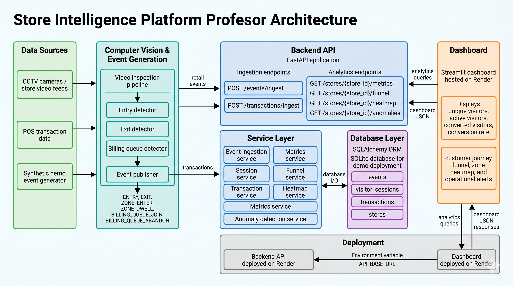
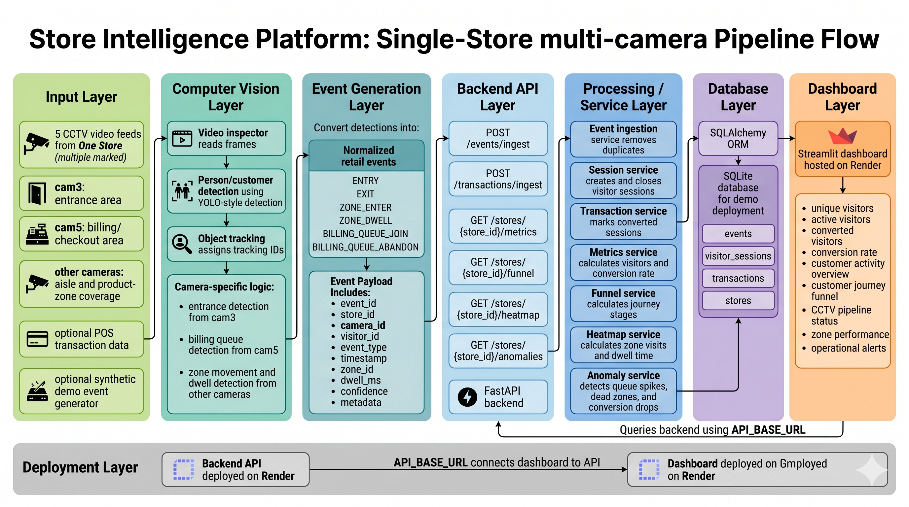
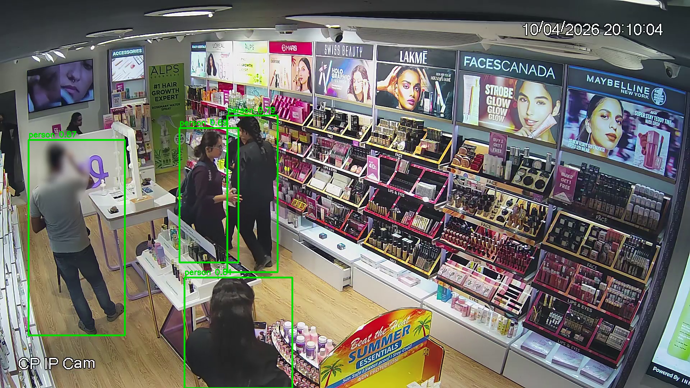
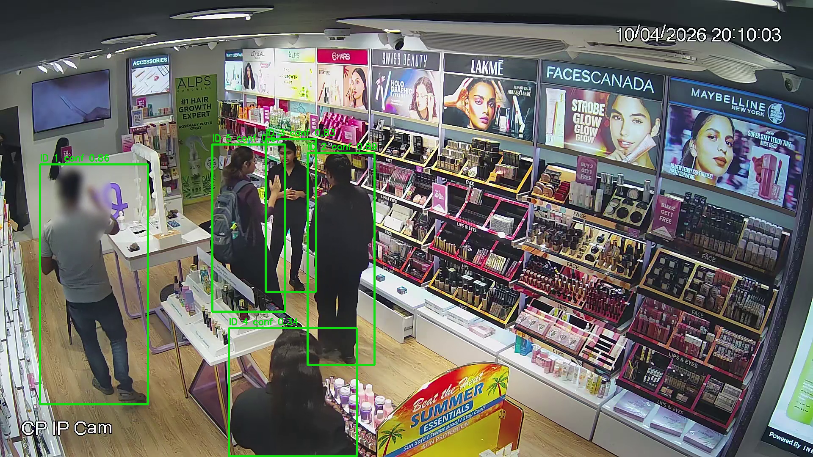

# Store Intelligence API

Store Intelligence API is a FastAPI-based retail analytics backend for a hiring challenge. It ingests store events, tracks visitor sessions, calculates conversion metrics, and exposes analytics for funnels, heatmaps, and anomalies. The implementation is intentionally backend-first and optimized for clarity, testability, and fast iteration.

## 1. Project Overview

This project models the core analytics layer of a store intelligence platform. It accepts retail event streams, maintains visitor sessions, and derives operational metrics that are useful for store performance analysis. The current implementation uses SQLite for local development and challenge submission simplicity, while keeping the codebase structured so a later database swap remains straightforward.

## 2. Architecture Overview

The codebase follows a layered FastAPI architecture:

- API layer: request/response handling and dependency injection
- Service layer: business rules and analytics calculations
- Model layer: SQLAlchemy ORM tables
- Schema layer: Pydantic request and response validation
- Core layer: configuration, logging, and middleware
- DB layer: engine, session factory, and initialization scripts

This separation keeps route handlers thin and makes the core analytics logic easy to test in isolation.

### System Architecture

The platform is organized as an end-to-end retail intelligence pipeline. CCTV/video-derived events, POS transactions, and synthetic demo events are ingested by the FastAPI backend. The service layer turns those raw events into sessions, conversion metrics, funnel stages, heatmap data, and operational alerts. The Streamlit dashboard then queries the API and presents the analytics for store teams.



Key flow:

- CCTV/video feeds and demo generators produce customer activity events.
- Event and transaction payloads are sent to the FastAPI ingestion endpoints.
- SQLAlchemy persists events, sessions, stores, and transactions.
- Analytics services compute metrics, funnels, heatmaps, and anomalies.
- The Streamlit dashboard reads JSON responses from the deployed API and renders the live store view.

### Pipeline Flow

The pipeline below shows how the five CCTV feeds from one store become normalized retail events and then dashboard-ready analytics. The important detail is that camera feeds remain separate through `camera_id`, but all events roll up into the same `store_id` for one store-level dashboard.



Pipeline stages:

- Input layer: five CCTV videos, optional POS transactions, and optional synthetic demo events.
- Computer vision layer: frame inspection, customer detection, tracking IDs, and camera-specific rules.
- Event generation layer: detections become structured events such as `ENTRY`, `ZONE_DWELL`, and `BILLING_QUEUE_JOIN`.
- Backend and service layer: FastAPI accepts events, removes duplicates, updates sessions, computes metrics, builds funnels, and detects anomalies.
- Database and dashboard layer: SQLAlchemy stores events/sessions/transactions, while Streamlit queries the API and renders the live analytics view.

### CCTV Video Interpretation

The provided videos are treated as multiple CCTV camera feeds from one physical store, not as separate stores. Each feed contributes events to the same `store_id`, while `camera_id` identifies where the event came from.

Camera mapping used for the demo story:

- `cam3` - entrance camera, used for customer entry detection
- `cam5` - billing area camera, used for billing queue and checkout activity
- Remaining camera feeds - store-zone coverage for aisle movement, dwell behavior, and operational context

This keeps the dashboard focused on one store-level view while still showing that the analytics pipeline can combine evidence from multiple camera angles.





## 3. Features

- Event ingestion with idempotency
- Visitor session lifecycle tracking
- Transaction ingestion with conversion updates
- Store metrics endpoint
- Funnel analytics endpoint
- Heatmap analytics endpoint
- Anomaly detection endpoint
- CCTV pipeline status panel for camera-to-analytics proof
- Structured JSON request logging
- Automated pytest coverage

## 4. API Endpoints

- `GET /docs` - Swagger UI
- `GET /health` - application health check
- `POST /events/ingest` - ingest retail events
- `POST /transactions/ingest` - ingest transactions and mark conversions
- `GET /stores/{store_id}/metrics` - store metrics
- `GET /stores/{store_id}/funnel` - funnel analytics
- `GET /stores/{store_id}/heatmap` - heatmap analytics
- `GET /stores/{store_id}/anomalies` - anomaly detection

## 5. Project Structure

```text
store-intelligence/
├── app/
│   ├── api/
│   ├── core/
│   ├── db/
│   ├── models/
│   ├── schemas/
│   └── services/
├── data/
├── docs/
├── pipeline/
├── tests/
├── Dockerfile
├── docker-compose.yml
├── requirements.txt
└── README.md
```

## 6. Local Setup

Create and activate a virtual environment:

```powershell
py -3.12 -m venv venv
.\venv\Scripts\Activate.ps1
```

Install dependencies:

```powershell
pip install -r requirements.txt
```

Run the application:

```powershell
uvicorn app.main:app --reload
```

## 7. Docker Setup

This project runs with a single Docker service backed by SQLite.

```powershell
docker compose up --build
```

The container exposes port `8000` and mounts `./data` so the SQLite database persists across runs.

## 7.1 Deploy on Render

This repository includes a Render blueprint file: `render.yaml`.

### One-time setup

1. Open Render and create a new Blueprint deploy from this GitHub repository.
2. Render will detect `render.yaml` and create two web services:
	- `store-intelligence-api`
	- `store-intelligence-dashboard`
3. After the first deploy, copy the API service URL (for example: `https://store-intelligence-api.onrender.com`).
4. In the dashboard service settings, set `API_BASE_URL` to that API URL and redeploy the dashboard.

### Notes

- The current Render blueprint uses SQLite at `/tmp/store_intelligence.db` for quick challenge deployment.
- `/tmp` is ephemeral on Render, so data may reset on restarts.
- For persistent production data, move to Render Postgres and set `DATABASE_URL` to the provided Postgres URL.

## 8. Running Tests

Run the test suite:

```powershell
pytest -v
```

The tests use isolated in-memory SQLite fixtures, so they do not depend on the local development database.

## 9. API Documentation

Once the app is running, open:

- `http://localhost:8000/docs`

Swagger provides interactive request/response testing for the ingestion and analytics endpoints.

## 10. Assumptions and Limitations

- The current solution uses SQLite for speed and simplicity during the challenge.
- The backend is designed so PostgreSQL can be added later without changing the domain logic.
- The analytics currently operate on the data that exists in the local database.
- Computer vision is intentionally deferred until the backend scoring path is complete and the dataset is clearer.
- The heatmap and anomaly logic are based on event/session heuristics rather than a full production ML pipeline.

## 11. Live Dashboard (Streamlit)

A lightweight Streamlit dashboard is included to demonstrate the live analytics pipeline.

Live dashboard:

- https://store-intelligence-dashboard-knpe.onrender.com/

Live API:

- https://store-intelligence-api.onrender.com/

Start the API:

```powershell
uvicorn app.main:app --reload
```

Start the dashboard in a second terminal:

```powershell
streamlit run dashboard/streamlit_app.py
```

Dashboard capabilities:

- Store selector dropdown
- Unique Visitors
- Conversion Rate
- Active Visitors
- Funnel Metrics
- Customer Activity Overview
- Heatmap Metrics
- Active Anomalies
- Auto-refresh every 10 seconds

Optional environment variables:

- `API_BASE_URL` (default: `http://127.0.0.1:8000`)
- `DEFAULT_STORE_ID` (default: `STORE_BLR_001` for the deployed demo)
- `DEMO_SEED_ON_STARTUP` (default: `false`; set to `true` on the Render API service to seed demo data only when the target store is empty)

### Dashboard Walkthrough

The deployed dashboard is arranged as a scrollable store operations view. It starts with executive KPIs, then moves into activity, funnel behavior, zone performance, alerts, and final business outcomes.

#### 1. KPI Summary and Customer Activity

The first screen gives the store manager a fast health check: unique visitors, active visitors, completed purchases, and conversion rate. The second KPI row summarizes today's operational activity, including entries, billing interactions, purchases, and total customer events.


#### 2. Customer Journey Funnel

The funnel view shows how customers move from entry to zone engagement, billing interest, and completed purchase. It makes drop-off visible at each stage so the store team can identify where attention is needed.


#### 3. Customer Activity Overview

The customer activity section summarizes entry traffic, billing interactions, purchases, and total daily events. It gives store teams a quick operational read without exposing backend implementation details.

#### 4. Zone Performance and Operational Alerts

The zone performance section is used for heatmap and dwell-time analytics. The operational alerts section highlights anomalies such as queue spikes, low-engagement zones, or conversion drops when they are detected.


#### 5. Business Summary

The closing dashboard section keeps the presentation business-facing and summarizes the impact areas: journey insights, zone performance, queue monitoring, and real-time decision support.


## 12. Demo Data Generator

Use the mock generator to simulate live event streams during demos.

```powershell
python pipeline/mock_event_generator.py --base-url http://127.0.0.1:8001 --stores store-001,store-002 --volume 50 --batch-size 100
```

Generated journey sequence per visitor:

- `ENTRY`
- `ZONE_ENTER`
- `ZONE_DWELL`
- `BILLING_QUEUE_JOIN`
- `EXIT`

Useful flags:

- `--volume`: visitor journeys per run
- `--batch-size`: events per ingest request
- `--sleep-seconds`: delay between batches for live demos

## 13. Submission Assets

- Dashboard screenshots are saved in `docs/` and `docs/screenshots/`
- Keep demo video files out of the repository; `.gitignore` already excludes the common locations
- The demo runner prints a compact summary, including CCTV pipeline status, funnel, heatmap, and anomaly output

## 14. Team

- Project lead: Jahnavi Yelishala — engineer / architect
- Contact: (add preferred contact email or GitHub handle)

## 15. Running the CV Pipeline (YOLOv8)

1. Place the weights file `yolov8n.pt` in the repository root (already included for convenience in the challenge submission).
2. Install detection dependencies (see `requirements_cv.txt`):

```powershell
pip install -r requirements_cv.txt
```

3. Run an example detector script in `pipeline/` (example):

```powershell
python pipeline/detect_people.py --weights yolov8n.pt --source path/to/video.mp4 --publish-url http://127.0.0.1:8000/events/ingest
```

Notes:
- The `pipeline/` scripts produce normalized events and can push them to the API. For demo runs, `pipeline/mock_event_generator.py` remains the fastest way to show functionality.

## 16. Dataset Alignment

The current implementation is aligned to the challenge camera-role mapping stored in [config/camera_roles.json](config/camera_roles.json).

- `CAM1` - `ZONE`
- `CAM2` - `ZONE`
- `CAM3` - `ENTRANCE`
- `CAM4` - `EXIT`
- `CAM5` - `BILLING`

Operational assumptions used by the code:

- Staff traffic is filtered by the `is_staff` flag before it reaches visitor session logic or analytics.
- A visitor who returns shortly after an EXIT is reclassified as `REENTRY` within the configurable `REENTRY_WINDOW_MINUTES` window.
- Conversion is measured from a billing-zone event plus a POS transaction within the configurable correlation window (`POS_CONVERSION_WINDOW_MINUTES`).
- Event confidence uses detector confidence first, tracker confidence second, and a small fallback only when neither is present.
- The live dashboard focuses on KPIs, funnel, zone performance, and alerts; backend diagnostics are intentionally kept out of the business view.

Known limitations:

- If the dataset revises the camera roles, only `config/camera_roles.json` should need updating.
- The current CV scripts still depend on YOLOv8 detections and simple tracking heuristics; they are intentionally lightweight for the hackathon setting.
- Re-entry is handled with a time window rather than heavy re-identification.
- Group/party tracking is not implemented.

## Links to additional documentation

- Architecture notes: `docs/ARCHITECTURE.md`
- Deployment guide: `docs/DEPLOYMENT.md`
- API reference: `docs/API_REFERENCE.md`
- Demo guide: `docs/DEMO_GUIDE.md`

